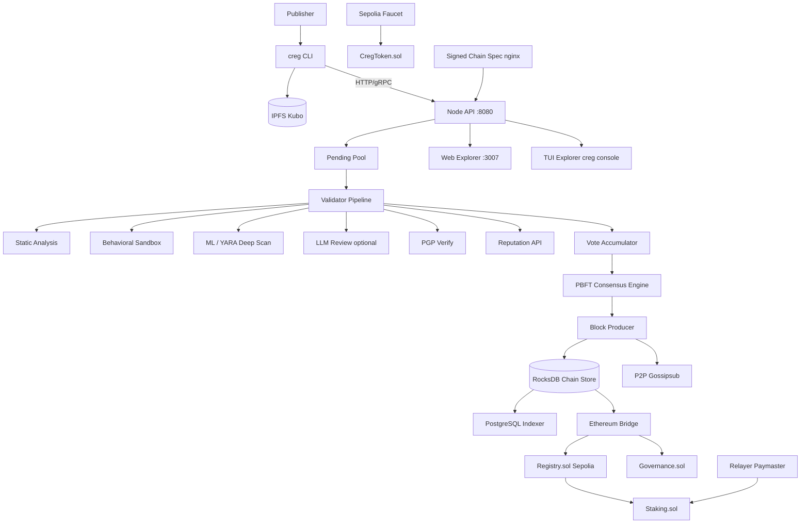
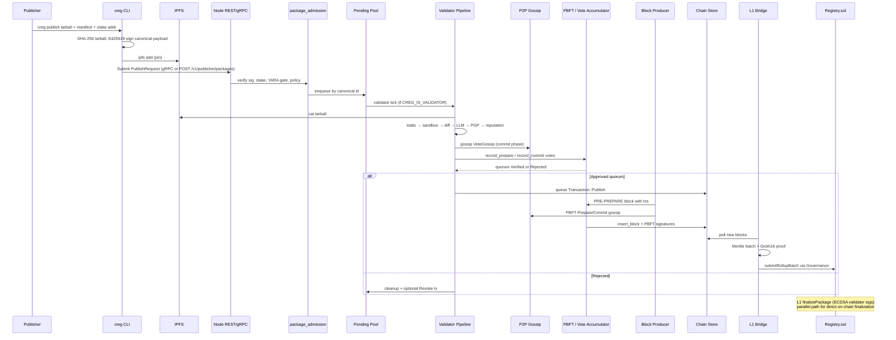
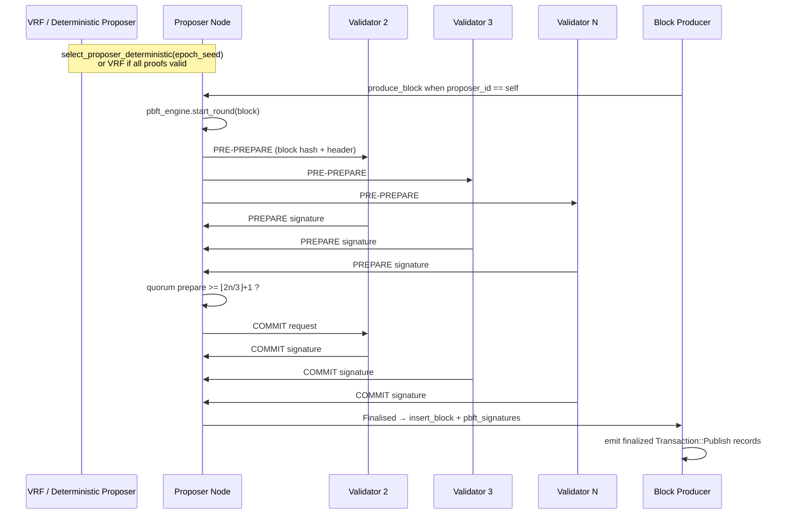
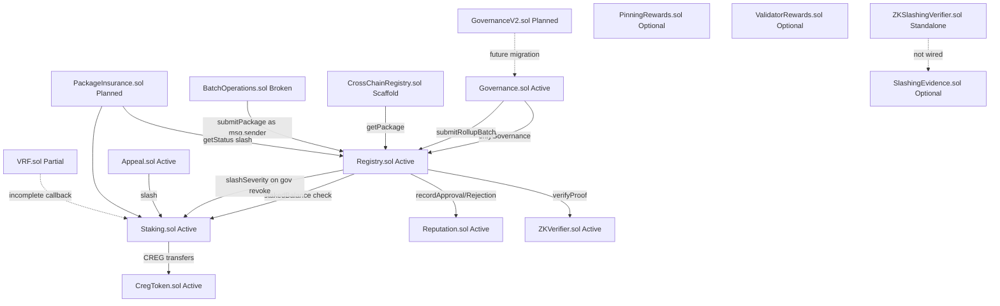

# Chain Registry — Deep Dive Technical Analysis

> Version: 0.1.0 (chain-spec alpha / creg-testnet-1) | Analysis Date: 2026-06-06

## Table of Contents

1. [Executive Summary](#1-executive-summary)
2. [System Architecture](#2-system-architecture)
   - 2.1 [Overall Architecture](#21-overall-architecture)
   - 2.2 [Publish-to-Finalization Data Flow](#22-publish-to-finalization-data-flow)
3. [Subsystem Deep Dives](#3-subsystem-deep-dives)
   - 3.1 [Validator Pipeline](#31-validator-pipeline)
   - 3.2 [Consensus & Blockchain](#32-consensus--blockchain)
   - 3.3 [Smart Contract System](#33-smart-contract-system)
   - 3.4 [CLI System](#34-cli-system)
   - 3.5 [Explorer System](#35-explorer-system)
   - 3.6 [Supporting Infrastructure](#36-supporting-infrastructure)
4. [Issue Registry](#4-issue-registry)
5. [Improvement Roadmap](#5-improvement-roadmap)
6. [Strengths & Positive Observations](#6-strengths--positive-observations)
7. [Glossary](#7-glossary)

---

## 1. Executive Summary

Chain Registry is a **decentralized software supply-chain registry** implemented as a Rust workspace (`chain-registry/`) with an Ethereum L1 settlement layer. Publishers submit content-addressed packages (IPFS CIDs, SHA-256 hashes) to validator nodes; each package enters a **pending pool**, passes a multi-stage **validator pipeline** (static analysis, behavioral sandbox, differential analysis, optional LLM review, PGP, reputation), and is voted on by economically staked validators using **Ed25519 domain-separated signatures**. Approved packages are finalized into a **PBFT-backed append-only chain** stored in **RocksDB**, gossiped over **libp2p Gossipsub**, and periodically batched to L1 via a **Groth16 rollup bridge** that submits state transitions through **Governance.sol**. The canonical L1 package ledger lives in **Registry.sol** on Sepolia testnet (chain id 11155111), with companion contracts for staking, reputation, ZK verification, and governance.

The codebase is architecturally ambitious: seventeen Rust crates cover consensus, ZK proofs (arkworks Groth16), ML/YARA scanning, WASM sandboxing, threshold encryption (feature-flagged off on testnet), cross-chain scaffolding, faucet, relayer, indexer, and secrets management. Production hardening is uneven: the node binary denies `clippy::unwrap_used`, yet several hot paths use `unwrap_or_default` fallbacks that weaken gossip integrity; ZK circuits document content-hash binding but do not constrain hashes in R1CS; and several Solidity auxiliary contracts (VRF callback, BatchOperations, CrossChainRegistry adapter) are incomplete or unsafe for production deployment.

**Operational posture today:** The primary `docker-compose.yml` targets **Sepolia** with IPFS, signed chain-spec server, node, PostgreSQL, indexer, faucet, relayer, and web explorer (port 3007). Local three-validator clusters and Kubernetes manifests exist for broader testing. Feature flags in `chain-spec.sepolia.json` enable ZK, ML, and WASM validation while **cross-chain, insurance, and threshold encryption remain disabled**.

This analysis was produced by reading the workspace manifest, Docker topology, node entrypoint, common block/package types, Registry.sol, seventeen subsystem source files, production Solidity contracts, and automated grep sweeps for panics, TODOs, and hardcoded localhost defaults. Every issue entry cites a verified file path and line number from the current tree dated 2026-06-06.

**Risk summary:** Five critical/high findings center on ZK soundness gaps, gossip signature fallbacks, bridge startup panics, and broken batch/on-chain publisher identity. Medium findings include simplified P2P PBFT validation, incomplete VRF on-chain selection, and permissionless `finalizePackage`. The system’s core value proposition—consensus-gated installs—is real and partially implemented end-to-end, but operators should treat testnet deployments as **alpha** until ZK binding, validator-set sync, and contract edge cases are closed.

---

## 2. System Architecture

### 2.1 Overall Architecture

The node (`crates/node`) is a single async Tokio binary that wires HTTP (axum), gRPC (tonic), libp2p, RocksDB, optional ZK/ML/WASM subsystems, and background tasks (validator pipeline, block producer, bridge, sync, validator-set sync). Docker Compose binds host port **8090→8080** for the API and **3007** for the standalone React explorer proxied through nginx.

### 2.2 Publish-to-Finalization Data Flow

---

## 3. Subsystem Deep Dives

### 3.1 Validator Pipeline

The validator pipeline (`crates/node/src/validator_pipeline.rs`) is the security-critical path from pending pool to finalized chain records. Non-validator nodes **do not** drain the pool (`CREG_IS_VALIDATOR=false`), preventing observer nodes from consuming work meant for staked validators.

#### 3.1.1 Stage 1 — Static Analysis (extended)

`crates/validator/src/static_analysis.rs` implements tarball extraction, regex/entropy heuristics, configurable pattern files (`CREG_PATTERNS_FILE`), typosquat checks (Levenshtein against `data/typosquat.json`), rule-based ML scoring, and YARA-X deep scan integration via `ml-validator`. OSV dependency lookups are **intentionally disabled** (line 511: `pkg_info = None`) to preserve deterministic consensus across validators—validators must not call non-deterministic external APIs during consensus rounds unless all nodes share identical cached responses.

Pattern matching covers high-risk idioms: `eval`, subprocess spawns, credential exfiltration URLs, obfuscated JavaScript, and ecosystem-specific install hooks. Entropy analysis flags base64 blobs and nested encoding. Typosquat detection refreshes from `CREG_TYPOSQUAT_URL` hourly with merge-only updates to avoid flip-flopping verdicts mid-round. Evidence is grouped into `EvidenceGroup` structures with determinism flags so the risk aggregator can separate reproducible vs advisory findings.

The static stage emits `AnalysisBundleRefs` populated from on-disk bundle manifests (`validator/src/bundle.rs`), enabling downstream votes to cite exact policy versions. When deep scan returns `is_mock: true`, static analysis adds finding **ML001** so operators can distinguish real YARA hits from degraded-mode placeholders.

#### 3.1.2 Stage 2 — Behavioral Sandbox

`crates/validator/src/sandbox.rs` attempts isolation in order: **nsjail → gVisor → Docker → WASM → fail-closed**. Manifest declarations (`PackageManifest`) gate network hosts, filesystem writes, and process spawns (SB001–SB004). `CREG_DEV_SANDBOX=true` injects a High-severity finding (SB012) but still returns metrics—useful for dev, dangerous if misconfigured in production. Engine-specific seccomp profiles ship under `config/sandbox/`. Results are cached keyed by canonical package id for the diff stage.

#### 3.1.3 Stage 3 — ML Deep Scan

`crates/ml-validator/src/deep_scan.rs` runs YARA-X rules, optional OSV (env-gated), and content-hash threat intel. ONNX inference was retired; `mock_result()` and `timeout_result()` return `is_mock: true` with `ThreatClassification::Degraded`, which propagates to static analysis as finding ML001. Validators exclude non–consensus-grade votes when `ml_model_version` starts with `degraded` or bundle refs are incomplete (`common::is_consensus_grade_vote`).

#### 3.1.4 Stage 4 — LLM-Assisted Review

`crates/validator/src/llm.rs` provides advisory-only analysis via Anthropic, OpenAI, OpenRouter, or Ollama with rate limiting and structured JSON output. When disabled, `LlmReview::degraded()` emits LLM-SKIP findings without blocking deterministic stages. LLM output never sole-sources rejection unless combined with deterministic thresholds in `validate_package`.

#### 3.1.5 Validator Pipeline Flowchart

```mermaid
flowchart LR
    Start([Pending package]) --> Fetch[Fetch IPFS tarball]
    Fetch --> Shielded{shielded?}
    Shielded -->|yes| Decrypt[X25519 decrypt key_bundle]
    Shielded -->|no| Validate
    Decrypt --> Validate[validator::validate_package]
    Validate --> S1[Static Analysis]
    S1 --> S2[Sandbox]
    S2 --> S3[Diff vs prior manifest/sandbox]
    S3 --> S4[LLM optional]
    S4 --> S5[PGP optional]
    S5 --> S6[Reputation HTTP]
    S6 --> Decision{Deterministic risk + vote}
    Decision -->|Approve| SignVote[Ed25519 sign ValidatorSignature]
    Decision -->|Reject| SignReject[Sign reject vote]
    SignVote --> Gossip[Gossip VoteGossip]
    SignReject --> Gossip
    Gossip --> Quorum{Vote accumulator quorum?}
    Quorum -->|yes| FinalTx[Transaction::Publish → block producer]
    Quorum -->|no / timeout| Cleanup[Remove from pending]
    ThresholdPath[[Threshold Shamir decrypt]] -.->|disabled feature flag| Decrypt
    DevSandbox[[CREG_DEV_SANDBOX]] -.->|bypass real sandbox| S2
    MockML[[deep_scan mock/timeout]] -.->|degraded vote| S1
```

Orchestration lives in `crates/validator/src/lib.rs` (`validate_package`), returning `ValidationResult` with vote, findings, PGP fingerprint, bundle refs, and risk summary. Optional AAA post-rejection audit calls an external HTTP endpoint when configured.

---

### 3.2 Consensus & Blockchain

#### 3.2.1 PBFT Three-Phase Protocol (extended)

`crates/consensus/src/pbft.rs` implements PRE-PREPARE → PREPARE → COMMIT with Ed25519 signatures over `creg-pbft-v1:{phase}:{block_hash}`. Quorum defaults to ⌊2n/3⌋+1 with optional 2-of-3 bootstrap for three-validator dev clusters (`CREG_PBFT_ALLOW_SMALL_CLUSTER_QUORUM`). View-change certificates require ⌊n/3⌋+1 participants. Terminal rounds are garbage-collected after a configurable TTL.

Package-level consensus uses a **separate** `VoteAccumulator` with message domain `creg-vote-v2`, binding votes to `(canonical, content_hash, validator_pubkey, scanner_profile_digest, evidence_digest)`. Degraded votes—those with incomplete bundle refs or `ml_model_version` prefixed with `degraded`—can be excluded from quorum tallies when `CREG_DEGRADED_VALIDATOR_WARN_RATIO` thresholds are exceeded, preventing mock-ML nodes from blocking honest supermajorities.

Block-level PBFT signatures are stored on each `Block` as `pbft_signatures: Vec<BlockSignature>` and exposed via light-client proofs for resolver verification. The engine rejects PRE-PREPARE messages from non-proposers unless the claimed proposer matches `select_proposer_deterministic` output for the epoch seed, tying block production to the validator set hash embedded in block headers.

#### 3.2.2 VRF Proposer Selection

`crates/consensus/src/vrf.rs` uses Ed25519 sign(seed) hashed as VRF output—not a full RFC 9381 VRF. `select_proposer` only uses VRF scores when **every** active validator supplies valid proofs; otherwise `select_proposer_deterministic` picks the lowest `SHA256(pubkey:epoch_seed)`. Block production (`block_producer.rs`) proves VRF locally but still compares against deterministic selection, keeping proposer rotation predictable across nodes.

#### 3.2.3 Block Production & Chain Store

`crates/node/src/block_producer.rs` ticks every `CREG_BLOCK_INTERVAL` seconds (default 5), drains finalized transactions, builds blocks with Merkle transaction roots, starts PBFT rounds, self-casts votes, and inserts blocks when local quorum is met. `crates/node/src/chain_store.rs` persists blocks and package index in RocksDB column families with atomic write batches for revocations and key rotations.

#### 3.2.4 Ethereum Bridge

`crates/node/src/bridge.rs` batches verified blocks, computes Merkle data roots, generates Groth16 proofs via `zk-validator`, and submits `submitRollupBatch` through **Governance** using a hot bridge key (`CREG_BRIDGE_KEY`). Bridge is disabled when governance address or bridge key is unset. L1 chain id is validated at startup (`validate_l1_chain_id` in `main.rs`).

#### 3.2.5 P2P Layer

`crates/node/src/p2p.rs` runs libp2p with Gossipsub topics for votes, blocks, submissions, and VRF proofs; Kademlia for peer discovery; identify for storage shard hints. Vote gossip is validated in `validate_vote_gossip_message` with consensus-grade checks. PBFT Prepare handling uses pubkey lookup from local validator set rather than full PBFT signature verification (noted at line 557). Rate limiting and temporary bans live in `p2p_rate_limit.rs`.

#### 3.2.6 PBFT Consensus Round

Package-level voting uses a parallel **`VoteAccumulator`** (`vote_accumulator.rs`) with domain `creg-vote-v2` before transactions reach block production.

---

### 3.3 Smart Contract System

#### 3.3.1 Contract Interaction Map

#### Registry.sol (Active)

Core L1 ledger: `submitPackage`, `submitPackageWithZKProof`, `finalizePackage`, `verifyZKProof`, `revokePackage`, rollup batch submission. Uses custom reentrancy guard on `withdrawFees` only; ZK proof public inputs bind to `(canonical, contentHash, ipfsCid)` via `_packageZKBindingInputs`. **`finalizePackage` is callable by any address**—security relies entirely on ECDSA validator signature verification and staking membership checks inside the loop.

Publisher flow on L1: (1) `submitPackage` requires `staking.stakedBalance(msg.sender) > 0`, recording `Pending` status; (2) off-chain validators run the Rust pipeline and PBFT; (3) relayer or permissionless caller invokes `finalizePackage` with `ValidatorSig[]` array—each sig must recover to an active staked validator address over `_sigDigest(canonical, contentHash)`; (4) upon quorum, status becomes `Verified` and reputation counters update. ZK fast path bypasses PBFT when `submitPackageWithZKProof` or `verifyZKProof` succeeds against `ZKVerifier`. Rollup path (`submitRollupBatch`) is governance-only and intended for L2 state root anchoring separate from per-package finalize.

Revocation allows governance (with `slashSeverity`) or publisher self-revoke without slash. Dependency tracking via `dependentCounts` is governance-set only—not automatically derived from package manifests.

#### Staking.sol (Active)

Publisher and validator staking in CREG token; EIP-712 consensus admission; slashing with severity tiers; unbonding and withdraw with `nonReentrant` guards. Gates Registry publishes via `stakedBalance > 0`.

#### Governance.sol (Active)

M-of-N multisig proposals with timelock patterns, pause co-signing, arbitrary `target.call` on execution. Canonical governance for production Sepolia deployment.

#### ZKVerifier.sol + Groth16Verifier.sol (Active)

On-chain Groth16 verification via BN254 precompiles; governance rotates verifying keys.

#### Auxiliary contracts

- **VRF.sol**: Chainlink request path incomplete in `fulfillRandomWords` (empty validator selection).
- **BatchOperations.sol**: Calls `registry.submitPackage` as contract—breaks publisher stake check (`msg.sender` is batch contract).
- **CrossChainRegistry.sol**: Axelar adapter `setChainName` lacks access control.
- **Appeal.sol**: ETH transfers without reentrancy guard.
- **GovernanceV2.sol**, **PackageInsurance.sol**: Present but not integrated with Rust node testnet path.

---

### 3.4 CLI System

#### 3.4.1 Command Taxonomy

The `creg` binary (`crates/cli/src/main.rs`, version 0.1.0) exposes 27+ subcommands including: `install`, `status`, `publish`, `submit-signed`, `recovery`, `setup-shims`, `audit`, `verify`, `watch`, `stake`, `console`, `blocks`, `doctor`, `multisig`, `advanced` (zk/ml/wasm), `batch`, `policy`, `chain-spec`, `testnet`, `keygen`, `search`, `info`, `graph`, `diff`, `sbom`, `update`, `init`, `config`, `completions`.

Global flags: `--unverified`, `CREG_NODE_URL`, `CREG_GRPC_URL`, `--output json`.

#### 3.4.2 Package Manager Shims

`setup-shims` installs ecosystem wrappers (`npm`, `pip`, `cargo`, etc.) that route installs through `creg install` with resolver cache and org policy (`~/.creg/policy.toml`).

#### 3.4.3 Multisig Workflow

`creg multisig init|sign|submit` implements Ed25519 threshold publishing with HMAC-protected session files. Submit posts to `/v1/packages` (legacy alias)—functionally equivalent to `/v1/publisher/packages` but bypasses publisher-specific route documentation; session init infers package id from filename rather than tarball metadata.

#### 3.4.4 TUI Dashboards & Explorer

`creg console` launches Ratatui explorer (`explorer_tui.rs`) against node HTTP APIs. Web explorer is a Vite/React app built separately (`explorer/`) and served on port 3007 in Compose.

---

### 3.5 Explorer System

**Web explorer** (`explorer/`): React SPA with nginx reverse proxy to node API, relayer, and faucet; Sepolia wallet integration via env-injected contract addresses. Operator endpoints require `CREG_OPERATOR_API_KEY` / `VITE_OPERATOR_API_KEY`.

**Embedded UI** (`crates/node/src/explorer.rs`): Served at `/ui/` on the node when enabled.

**Indexer** (`creg-indexer` / `db-sync`): Polls RocksDB-backed chain data into PostgreSQL for search and analytics (`CREG_PG_URL`).

**Resolver** (`crates/resolver`): Client-side install trust via sled cache, live node queries, optional light-client Merkle + PBFT signature verification (`light_client.rs`).

---

### 3.6 Supporting Infrastructure (extended)

| Component | Location | Role |
|-----------|----------|------|
| Docker Compose (Sepolia) | `docker-compose.yml` | IPFS, spec-server, node, postgres, faucet, relayer, indexer, web-explorer |
| Local testnet | `docker-compose.local-testnet.yml`, `local-testnet.ps1` | 3-validator validated bootstrap |
| Anvil dev | `docker-compose.anvil.yml` | Legacy local L1 |
| Kubernetes | `k8s/` | Namespace, validators 1–10, postgres, ipfs, ingress, monitoring, backup |
| Observability | `observability/prometheus.yml`, `docker-compose.observability.yml` | Node metrics, IPFS, OTEL/Loki/Tempo targets |
| Chain spec | `testnet/chain-spec.sepolia.json` | Signed network params, contract addresses, feature flags |
| Secrets | `crates/secrets` | Vault/env hot-key loading for bridge, faucet, relayer |
| Faucet | `crates/faucet` | Sepolia CREG + ETH drips with PoW optional |
| Relayer | `crates/relayer` | Sponsored staking/token txs via policy JSON |

**Docker Compose service graph (Sepolia):** `ipfs` and `spec-server` are health-gated dependencies for `node`. The node mounts `./circuits`, `./validators`, and `./config/sandbox` read-only for ZK keys, WASM validators, and seccomp profiles. `indexer` shares `node-data` volume read-only to replicate chain state into PostgreSQL. `web-explorer` nginx config (`config/docker/explorer-nginx.sepolia.conf`) reverse-proxies node API, relayer, and faucet for browser same-origin access. `FAUCET_ADDRESS` is required at compose parse time—plan operator funding before `docker compose up`.

**Kubernetes:** Manifests under `k8s/` define a `crs` namespace pattern with separate validator StatefulSets (`20-validator.yaml`, `21-validators-2-5.yaml`, `22-validators-6-10.yaml`), Anvil for in-cluster L1 dev (`12-anvil.yaml`), ingress (`40-ingress.yaml`), and backup jobs (`60-backup.yaml`). ConfigMap `01-configmap.yaml` centralizes non-secret env; production deployments should mirror Sepolia env vars from compose.

**Observability:** Prometheus scrapes node `/metrics` every 10s (`observability/prometheus.yml`). Node exports sync state gauges (`disabled`, `syncing`, `synced`), validator pipeline counters, and admission rejection labels. Overlay compose adds Grafana/Alertmanager stacks documented in `observability/`.

**Admission and API surfaces:** Package submission flows through `package_admission.rs` with distinct surfaces for REST, gRPC, and gossip replay. Operator routes (`/v1/nodes`, `/v1/pending`, `/v1/runtime/config`) require `CREG_OPERATOR_API_KEY`. Publisher revoke requires validator or publisher Ed25519 authorization. Rate limits apply per IP and per publisher pubkey on hot paths.

**Insurance and IPFS pinning:** Crates `insurance` and `ipfs-pinner` exist in the workspace; feature flags disable insurance on Sepolia spec. Pinning rewards contract (`PinningRewards.sol`) is optional for incentivized IPFS persistence but not wired into the default compose stack.

---

## 4. Issue Registry

### 4.1 Critical Severity

### ISSUE-001: ZK package circuit does not bind content or manifest hashes

- **Severity**: Critical
- **File**: `crates/zk-validator/src/circuits.rs:17-21,65-112`
- **Description**: Module documentation and `PackageValidationCircuit` fields claim content/manifest hash verification, but `generate_constraints` never allocates or constrains `content_hash` / `manifest_hash` witnesses. Public inputs exposed via `PackageInputs::public_inputs()` omit hashes entirely; only score and boolean flags are proven.
- **Impact**: A malicious prover can generate valid Groth16 proofs for arbitrary packages while attesting passing scores, undermining ZK-fast-path trust if relied upon for admission.
- **Recommended Fix**: Add hash witnesses as public inputs (or commit in-circuit via Poseidon/SHA256 gadgets), constrain them against publisher-supplied values, and align `Registry.sol` `_assertPackageProofBinding` with circuit public signal layout. Regenerate trusted setup after circuit change.

### ISSUE-002: Gossip vote signature falls back on invalid validator key hex

- **Severity**: Critical
- **File**: `crates/node/src/validator_pipeline.rs:295-310`
- **Description**: `hex::decode(privkey_str).unwrap_or_default()` produces empty bytes on decode failure; the branch then reuses `our_sig.signature.clone()` without binding to the canonical gossip message format.
- **Impact**: Misconfigured nodes may broadcast votes that peers reject or mis-attribute, breaking quorum liveness or enabling signature confusion during incident response.
- **Recommended Fix**: Replace `unwrap_or_default` with explicit error handling—abort gossip and log fatal misconfiguration if `CREG_VALIDATOR_KEY` is invalid.

### ISSUE-003: BatchOperations breaks publisher stake identity

- **Severity**: Critical
- **File**: `contracts/BatchOperations.sol:55-60`
- **Description**: `batchSubmitPackages` loops `registry.submitPackage` as the batch contract address, not the end publisher. Registry checks `staking.stakedBalance(msg.sender)`.
- **Impact**: Batch submissions always fail stake gate unless the batch contract itself stakes—feature is non-functional and may confuse integrators.
- **Recommended Fix**: Add `publisher` field per submission and use `Staking` delegation pattern, or expose `submitPackageFor(publisher, ...)` on Registry with EIP-712 authorization.

### ISSUE-004: Bridge panics on malformed RPC URL at runtime

- **Severity**: Critical
- **File**: `crates/node/src/bridge.rs:85`
- **Description**: `rpc_url.parse().expect("CREG_ETH_RPC must be a valid URL")` inside the bridge retry loop will panic the task/thread on typoed env vars.
- **Impact**: Node process crash or bridge task exit; L1 anchoring halts silently after restarts with bad config.
- **Recommended Fix**: Parse URL once at startup in `config.rs` and propagate `Result`; bridge should log and disable itself like other subsystems.

---

### 4.2 High Severity

### ISSUE-005: Production guard panics when ZK keys missing

- **Severity**: High
- **File**: `crates/zk-validator/src/lib.rs:158-168`
- **Description**: With `CREG_PRODUCTION=true`, missing key files trigger `panic!` during `ZkValidator::new()`.
- **Impact**: Hard node crash on deploy ordering mistakes; correct for security but needs documented startup ordering and health checks.
- **Recommended Fix**: Fail startup gracefully in `main.rs` with actionable error before spawning tasks; document key provisioning in compose/k8s manifests.

### ISSUE-006: Empty gossip payload on JSON serialization failure

- **Severity**: High
- **File**: `crates/node/src/validator_pipeline.rs:333`
- **Description**: `serde_json::to_vec(&gossip_vote).unwrap_or_default()` broadcasts zero-length messages on failure.
- **Impact**: Peers receive malformed gossip; debugging difficulty and potential vote starvation.
- **Recommended Fix**: Treat serialization failure as fatal for that vote; increment metric `creg_gossip_serialize_errors`.

### ISSUE-007: P2P PBFT Prepare uses simplified signature validation

- **Severity**: High
- **File**: `crates/node/src/p2p.rs:556-565`
- **Description**: Comment acknowledges validation is simplified; Prepare path constructs `BlockSignature` from gossip without full domain-separated PBFT verify used in `pbft.rs`.
- **Impact**: Divergence between local PBFT engine and network gossip acceptance could allow invalid prepares on compromised or buggy peers.
- **Recommended Fix**: Route all PBFT gossip through `consensus::pbft` verify helpers shared with block producer.

### ISSUE-008: Permissionless finalizePackage on L1

- **Severity**: High
- **File**: `contracts/Registry.sol:304-351`
- **Description**: Any caller may invoke `finalizePackage` with validator ECDSA signatures; no role gate.
- **Impact**: Intended for trustless relaying, but signature replay or stale sig sets could grief pending packages if off-chain collection is sloppy.
- **Recommended Fix**: Document relay requirements; consider `nonce` per package round or allowlisted relayers for testnet.

### ISSUE-009: VRF contract callback incomplete — **FIXED**

- **Severity**: High (resolved)
- **File**: `contracts/VRF.sol`, `contracts/test/VRF.t.sol`
- **Description**: Chainlink VRF fulfillment did not persist validator selections requested in `requestValidatorSelection`.
- **Fix**: Pending requests now store `packageCanonical` and `activeValidators` at request time; `fulfillRandomWords` runs Fisher-Yates shuffle via shared `_selectValidatorsWithSeed`, writes `selections`, and emits `ValidatorsAssigned` with the full set. Added `MockVRFCoordinator` + 5 forge tests.
- **On-chain (Sepolia)**: Deployed `0x21C18341065436Ec680b867ACfd8251fb88a1d28` via `UpgradeSepoliaVRF.s.sol` / `testnet/upgrade-sepolia-vrf.ps1`. Chain spec + Docker spec-server updated (genesis hash `0xa203c2e58f0a13a...`).
- **Deploy note**: `Registry` still holds the old immutable VRF pointer (`0x63e5...`); governance-driven selection uses chain-spec `contracts.vrf` and direct VRF calls.

### ISSUE-010: CrossChainRegistry Axelar adapter lacks access control

- **Severity**: High
- **File**: `contracts/CrossChainRegistry.sol:601-603`
- **Description**: `AxelarAdapter.setChainName` callable by anyone.
- **Impact**: Chain name spoofing for cross-chain messages if adapter is deployed.
- **Recommended Fix**: `onlyGovernance` modifier; disable adapter until audited.

---

### 4.3 Medium Severity

### ISSUE-011: Publisher CLI uses placeholder ZK admission values

- **Severity**: Medium
- **File**: `crates/cli/src/publish.rs:165-169`
- **Description**: Hardcoded score 85 and `sandbox_safe: true` to satisfy circuit constraints for publisher-side attestation.
- **Impact**: Misleading if operators assume CLI proof reflects real analysis; validators re-run checks but users may trust client-side proof bytes.
- **Recommended Fix**: Run `advanced zk` pipeline pre-publish or label attestation as "publisher-declared" in metadata.

### ISSUE-012: ML deep scan returns mock results on invalid/timeout input

- **Severity**: Medium
- **File**: `crates/ml-validator/src/deep_scan.rs:326-354`
- **Description**: `mock_result()` / `timeout_result()` mark `is_mock: true` but still allow pipeline continuation with degraded classification.
- **Impact**: Validators may abstain or downgrade votes inconsistently depending on `CREG_DEGRADED_VALIDATOR_WARN_RATIO`.
- **Recommended Fix**: Fail closed for Critical-severity paths; uniform policy in `vote_accumulator.rs`.

### ISSUE-013: CREG_DEV_SANDBOX bypass

- **Severity**: Medium
- **File**: `crates/validator/src/sandbox.rs:245-271`
- **Description**: Dev flag skips real sandbox execution while emitting synthetic metrics.
- **Impact**: Accidental enablement in Compose/env leaks unanalyzed packages into vote stage.
- **Recommended Fix**: Require `CREG_TESTNET=true` alongside dev sandbox; add startup warning banner in API `/v1/health`.

### ISSUE-014: Threshold encryption disabled on testnet spec

- **Severity**: Medium
- **File**: `testnet/chain-spec.sepolia.json` (feature_flags.threshold_encryption: false)
- **Description**: Shielded publish path uses single-node X25519 (`common::decrypt_shielded_package`); Shamir path removed from pipeline.
- **Impact**: Shielded packages do not meet threshold confidentiality goals advertised in docs.
- **Recommended Fix**: Re-enable after `threshold-encryption` service integration and validator share distribution.

### ISSUE-015: WASM sandbox ignores CapabilitySet and ResourceLimits

- **Severity**: Medium
- **File**: `crates/wasm-sandbox/src/lib.rs:54-64,241-384`
- **Description**: `SandboxConfig.capabilities` unused; WASI linker stubs return errors instead of capability-driven policy.
- **Impact**: WASM engine fallback provides weak isolation compared to nsjail/Docker paths.
- **Recommended Fix**: Wire `capabilities.rs` / `limits.rs` into linker registration; capture stdout via stub `fd_write`.

### ISSUE-016: Sync lacks historical validator set verification

- **Severity**: Medium
- **File**: `crates/node/src/sync.rs:163-166`
- **Description**: Comment ISSUE-050: sync verifies signatures but not validator-set membership at historical heights.
- **Impact**: Long-range sync from malicious peer could accept blocks signed by since-ejected validators if set hash checks are incomplete.
- **Recommended Fix**: Store `validator_set_hash` per height and reject mismatches during `verify_block_signatures`.

### ISSUE-017: Governance API stub returns 501

- **Severity**: Medium
- **File**: `crates/node/src/api.rs:1114-1126`
- **Description**: `/v1/governance/proposals` returns NOT_IMPLEMENTED.
- **Impact**: Explorer governance pages empty on testnet despite on-chain Governance.sol activity.
- **Recommended Fix**: Index governance events from L1 or chain transactions.

### ISSUE-018: Appeal contract ETH transfers without reentrancy guard

- **Severity**: Medium
- **File**: `contracts/Appeal.sol:214-239`
- **Description**: Bond payouts use `transfer` without `nonReentrant`.
- **Impact**: Malicious publisher contract could reenter during appeal resolution.
- **Recommended Fix**: Apply OpenZeppelin `ReentrancyGuard` and pull-payment pattern.

---

### 4.4 Low Severity

### ISSUE-019: Multisig submit uses legacy REST path

- **Severity**: Low
- **File**: `crates/cli/src/multisig.rs:359`
- **Description**: Posts to `/v1/packages` instead of `/v1/publisher/packages`.
- **Impact**: Both routes call same handler today (`api.rs:203`); future ACL divergence could break multisig.
- **Recommended Fix**: Align with `publish.rs` URL helper.

### ISSUE-020: install.rs policy omits publisher in evaluate()

- **Severity**: Low
- **File**: `crates/cli/src/install.rs:63`
- **Description**: Passes empty publisher string to policy evaluation.
- **Impact**: Publisher allow/deny rules in `policy.toml` never apply on install.
- **Recommended Fix**: Plumb publisher from resolver verdict record.

### ISSUE-021: chain_store publisher_rotation_nonce O(n) scan

- **Severity**: Low
- **File**: `crates/node/src/chain_store.rs:388-407`
- **Description**: Linear scan of blocks for rotation nonce lookup.
- **Impact**: Performance degradation at high chain height.
- **Recommended Fix**: Secondary index CF keyed by `(publisher, nonce)`.

### ISSUE-022: DoubleSign slashing evidence placeholders

- **Severity**: Low
- **File**: `crates/zk-validator/src/slashing.rs:510-533`
- **Description**: Monitor evidence uses placeholder coordinates and `validator_privkey: "HIDDEN"`.
- **Impact**: Off-chain evidence export incomplete for slashing pipeline until finalized.
- **Recommended Fix**: Populate from vote gossip store with redaction policy.

### ISSUE-023: advanced.rs treats missing sandbox as safe for verify

- **Severity**: Low
- **File**: `crates/cli/src/advanced.rs:329-332`
- **Description**: ZK verify path sets sandbox unavailable to `true`.
- **Impact**: Local CLI verification could pass when sandbox engine missing.
- **Recommended Fix**: Mirror validator fail-closed semantics.

### ISSUE-024: Validator set sync disabled when staking address invalid

- **Severity**: Medium
- **File**: `crates/node/src/main.rs:647-674`
- **Description**: Invalid `CREG_STAKING_ADDR` parsing sets Address::ZERO and disables chain-authoritative validator set sync, falling back to static spec validators only.
- **Impact**: Nodes may diverge on validator membership vs L1 staking contract state.
- **Recommended Fix**: Fail fast on validator nodes when sync disabled; document required staking address in compose health checks.

### ISSUE-025: Shamir gf_div silent zero on invalid denominator

- **Severity**: Low
- **File**: `crates/threshold-encryption/src/shamir.rs:202-204`
- **Description**: Division by zero in GF(2^8) returns 0 instead of error.
- **Impact**: Corrupted secret reconstruction if duplicate share indices are supplied.
- **Recommended Fix**: Return `Err` on `b == 0`; validate unique share indices at split time.

---

## 5. Improvement Roadmap

### 5.1 Priority 1 — Security Fixes

1. Fix ZK circuit hash binding (ISSUE-001) and redeploy verifying keys on Sepolia.
2. Remove gossip signature fallbacks (ISSUE-002, ISSUE-006); harden validator key loading at startup.
3. Disable or repair `BatchOperations.sol` (ISSUE-003).
4. Unify PBFT gossip validation (ISSUE-007).
5. Patch Appeal reentrancy and CrossChain adapter ACL (ISSUE-010, ISSUE-018).

### 5.2 Priority 2 — Feature Completion

1. ~~Complete VRF.sol callback or remove from active chain spec (ISSUE-009).~~ Done — redeploy VRF on Sepolia for live on-chain fix.
2. Wire governance proposals API to L1 events (ISSUE-017).
3. Enable threshold encryption end-to-end when feature flag flips (ISSUE-014).
4. Integrate `ZKSlashingVerifier` with `SlashingEvidence` workflow.
5. Finish cross-chain client operational addresses (`cross-chain/src/lib.rs`).

### 5.3 Priority 3 — Performance & Scalability

1. Index publisher rotation nonces (ISSUE-021).
2. Parallelize validator pipeline per-package tasks with backpressure metrics.
3. Batch L1 submissions with calldata compression; monitor bridge gas on Sepolia.
4. Remote RocksDB/compaction tuning for indexer lag (`CREG_INDEXER_POLL_INTERVAL_SECS`).

### 5.4 Priority 4 — Technical Debt

1. Remove dead `run_multiphase` sandbox or integrate into `run()`.
2. Consolidate REST route documentation (`/v1/packages` vs `/v1/publisher/*`).
3. Replace deterministic VRF documentation with accurate security claims.
4. Add `IMPLEMENTATION_BACKLOG.md` tracking ISSUE-* IDs for CI grep gates.

---

## 6. Strengths & Positive Observations

1. **Defense in depth on validation**: Six deterministic stages plus optional LLM advisory, with explicit separation between consensus-grade and degraded votes (`is_consensus_grade_vote`, bundle refs).
2. **Node hardening**: `#![deny(clippy::unwrap_used)]` on main node crate; package admission centralizes stake/signature/YARA gates before pending pool insertion.
3. **L1 misconfiguration guards**: `CREG_EXPECTED_L1_CHAIN_ID` prevents silent wrong-network bridge settlement (`main.rs:155-199`).
4. **Signed chain spec boot**: Sepolia compose serves `chain-spec.sepolia.json` + detached Ed25519 signature via nginx spec-server—tamper-evident network config.
5. **Sandbox engine fallback chain**: nsjail → gVisor → Docker → WASM → fail-closed is a thoughtful production ordering (`sandbox.rs`).
6. **Light client path**: Resolver can verify Merkle proofs and PBFT quorum for installs without full node trust.
7. **Contract hygiene**: Registry ZK public input binding (`_assertPackageProofBinding`), custom errors, governance pause hook, and severity-tier slashing show mature Solidity patterns.
8. **Operational completeness**: Faucet, relayer, indexer, explorer, k8s manifests, and Prometheus scrape configs support real testnet operations—not just a single binary demo.
9. **Supply-chain transparency**: Votes carry `evidence_digest`, scanner profile digests, and ML model version for reproducibility audits.
10. **Documentation culture**: Inline ISSUE-* references and design docs (`VALIDATOR_SET_SYNC_DESIGN.md`) trace known gaps honestly.

---

## 7. Glossary

| Term | Definition |
|------|------------|
| **PBFT** | Practical Byzantine Fault Tolerance; three-phase commit protocol used for block finality among validators. |
| **VRF** | Verifiable Random Function; here implemented as Ed25519-sign-then-hash for proposer scoring, with deterministic fallback. |
| **Canonical ID** | Package identifier string `ecosystem:name@version` used as primary key across chain, API, and contracts. |
| **Pending Pool** | In-memory queue of submitted `PublishRequest` items awaiting validator pipeline processing. |
| **Vote Accumulator** | Per-package state machine collecting Ed25519 validator votes until prepare/commit quorum. |
| **Chain Record** | Finalized `ChainRecord` struct embedded in `Transaction::Publish` on the RocksDB chain. |
| **Shielded Package** | Tarball encrypted with AES-256-GCM; key distributed via `key_bundle` (X25519 or threshold shares). |
| **Analysis Bundle Refs** | Versioned identifiers for policy, ML, and LLM profiles used to reproduce validator decisions. |
| **Evidence Digest** | SHA-256 digest over deterministic findings considered when forming a vote. |
| **Consensus-Grade Vote** | Vote with complete bundle refs, non-degraded scanner version, and non-empty evidence digest. |
| **Groth16** | zk-SNARK proof system used for package validation and rollup batch proofs (Bn254 curve). |
| **Rollup Batch** | L1 `submitRollupBatch` call anchoring Merkle state root of off-chain registry chain. |
| **Registry.sol** | Primary Ethereum contract recording package status (Pending/Verified/Revoked). |
| **Staking** | CREG token stake required for publishers and validators; enforces economic security. |
| **Governance** | M-of-N multisig controlling parameter updates, rollup submission, and emergency pause. |
| **IPFS CID** | Content identifier where tarball bytes are pinned; validators fetch via `CREG_IPFS_URL`. |
| **Light Client Proof** | SPV-style Merkle proof + PBFT signatures returned by `/v1/packages/:canonical/proof`. |
| **Forced Inclusion** | Mechanism tracking txs censored too long; marks them for mandatory block inclusion. |
| **Typosquat** | Package name similarity attack detected via Levenshtein distance against known packages. |
| **YARA-X** | Pattern matching engine used in ML deep scan for malware signatures. |
| **libp2p Gossipsub** | Publish-subscribe overlay for votes, blocks, and submissions between nodes. |

---

*End of report. Total analysis covers 17 Rust workspace crates, 17+ production Solidity contracts, Docker/K8s deployment manifests, and Sepolia testnet chain spec `creg-testnet-1`.*
