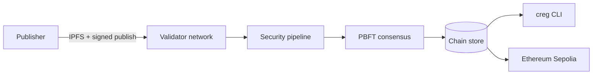

# Chain Registry (CREG)

A decentralized package registry that replaces single-authority trust (npm, PyPI, Cargo, and similar) with **independent validator consensus**. Packages are content-addressed, analyzed through a multi-stage security pipeline, finalized by PBFT quorum, and anchored to Ethereum.

**Network:** `creg-testnet-1` on Sepolia testnet · **Phase:** public alpha

---

## What problem this solves

Supply-chain attacks exploit one compromised maintainer or stolen API token. Chain Registry treats every publish as a **consensus decision**: economically staked validators run static analysis, behavioral sandboxing, and ML-assisted review before a package can reach **verified** status. Consumers install against cryptographic verdicts, not publisher reputation alone.

---

## How it works

1. **Publish** — A staked publisher signs a package, pins it to IPFS, and submits to the network.
2. **Validate** — Validators run a three-stage pipeline (static → sandbox → deep scan).
3. **Finalize** — A `⌊2n/3⌋+1` PBFT quorum records the verdict on the chain (RocksDB).
4. **Install** — The `creg` CLI reads **verified** status before delegating to npm/pip/cargo shims.
5. **Anchor** — State roots can be posted to Ethereum L1 via the Groth16 rollup bridge.



| Layer | Technology |
|-------|------------|
| Validator runtime | Rust · libp2p · axum |
| Consensus | PBFT · Ed25519 |
| Content addressing | IPFS |
| Smart contracts | Solidity on Sepolia (staking, registry, governance, ZK verifier) |
| CLI | `creg` — publish, install, stake, audit, multisig |
| ZK | Groth16 circuits (Circom) |

---

## Public testnet

| Service | URL |
|---------|-----|
| **API** | https://api.testnet.cregnet.dev |
| **Chain spec** | https://spec.testnet.cregnet.dev |
| **Explorer** | https://explorer.testnet.cregnet.dev |
| **Faucet** | https://faucet.testnet.cregnet.dev |
| **Join hub** | https://testnet.cregnet.dev |
| **Waitlist** | https://waitlist.cregnet.dev |

**Binaries:** [v0.1.0-testnet release](https://github.com/samuel-1-avson/chain-registry-core/releases/tag/v0.1.0-testnet) (`creg` + `creg-node` for Linux, Windows, macOS).

Chain parameters: [`testnet/chain-spec.sepolia.json`](testnet/chain-spec.sepolia.json).

---

## On GitHub

This repo is organized like other public blockchains — **protocol and consensus first**, not product web apps or hosting runbooks.

| What to explore | Where |
|-----------------|-------|
| **Protocol source** | This repository (root) |
| **Public documentation** | [`docs/PUBLIC.md`](docs/PUBLIC.md) |
| **ZK circuits** | [`circuits/`](circuits/) |
| **Release binaries** | [Releases](https://github.com/samuel-1-avson/chain-registry-core/releases) |

The alpha waitlist app is a separate product surface: live at [waitlist.cregnet.dev](https://waitlist.cregnet.dev), source in [samuel-1-avson/Creg-waitlist](https://github.com/samuel-1-avson/Creg-waitlist). Web apps (explorer, hub) and GCP deploy live in the private **chain-registry-ops** repo (maintainers only).

---

## Who this is for

| Audience | Start here |
|----------|------------|
| **Publishers & developers** | [docs/PUBLIC_TESTNET_QUICKSTART.md](docs/PUBLIC_TESTNET_QUICKSTART.md) |
| **Validators & node operators** | [testnet/OPERATOR.md](testnet/OPERATOR.md) |
| **Auditors & researchers** | [DEEP_DIVE_ANALYSIS.md](DEEP_DIVE_ANALYSIS.md) |
| **Testnet expectations** | [docs/TESTNET_PHASE_SCOPE.md](docs/TESTNET_PHASE_SCOPE.md) |

---

## Quick start (developers)

```bash
# From GitHub release
./scripts/install-creg.sh --version v0.1.0-testnet

# Or build from source
cargo build --release -p cli
```

```bash
export CREG_NODE_URL=https://api.testnet.cregnet.dev
creg doctor
```

---

## Repository layout (blockchain core)

This repository follows the same pattern as other open blockchains: **protocol code and public docs are visible**; web apps, waitlist infrastructure, and cloud deploy runbooks are not promoted from the default README.

| Path | Contents |
|------|----------|
| `crates/`, `contracts/`, `testnet/` | Rust workspace, Solidity, local testnet compose |
| [`circuits/`](circuits/) | ZK Groth16 circuits (Circom) |
| [`docs/PUBLIC.md`](docs/PUBLIC.md) | Curated public documentation index |

---

## Documentation

**[docs/PUBLIC.md](docs/PUBLIC.md)** — protocol, operators, contracts, circuits (public-facing only).

| Document | Purpose |
|----------|---------|
| [DEEP_DIVE_ANALYSIS.md](DEEP_DIVE_ANALYSIS.md) | Technical architecture and issue registry |
| [TESTNET_READINESS_REPORT.md](TESTNET_READINESS_REPORT.md) | Readiness assessment and evidence |
| [contracts/README.md](contracts/README.md) | Solidity contract status |
| [circuits/README.md](circuits/README.md) | ZK circuit build and verification |

---

## Status (June 2026)

| Milestone | Status |
|-----------|--------|
| Sepolia contracts + 3-node lab | Live |
| 2-validator PBFT quorum | Done |
| Real sandbox engine | Done |
| Public HTTPS testnet | Live — `testnet.cregnet.dev` |
| Binary release `v0.1.0-testnet` | Done |
| Public alpha waitlist | Live — [waitlist.cregnet.dev](https://waitlist.cregnet.dev) |
| External security audit | Scheduled — scope in maintainer docs |

This is a **public alpha testnet**, not mainnet. See [TESTNET_PHASE_SCOPE.md](docs/TESTNET_PHASE_SCOPE.md) for participant expectations.

---

## Contributing

Build and test from the repository root:

```bash
cargo test --workspace
cd contracts && forge test
```

Reference issue IDs from [DEEP_DIVE_ANALYSIS.md](DEEP_DIVE_ANALYSIS.md) in pull requests.

---

## License

MIT — see [LICENSE](LICENSE).
