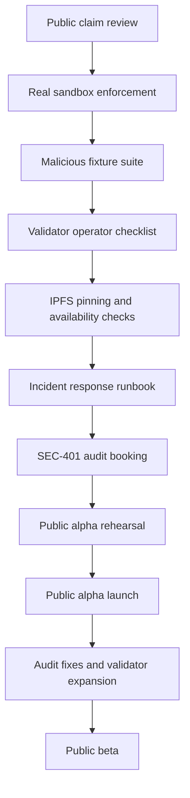

# CREG Limitations Public Readiness Implementation Plan

> Date: 2026-06-11  
> Purpose: Convert known limitations into concrete work before broad public onboarding.  
> Scope: Public alpha hardening before inviting external publishers, validators, auditors, and developers at scale.

## Executive Summary

CREG should be honest about its current limits, but the goal is not to leave those limits as passive warnings. This plan turns each limitation into an implementation track with concrete actions, acceptance criteria, and evidence requirements.

The current limitations are:

1. CREG cannot guarantee that no malicious package will ever be approved.
2. Validator collusion remains a risk in any staked consensus system.
3. IPFS content must be pinned to remain available.
4. LLM review is advisory, not a deterministic trust root.
5. ZK and contracts require external audit before production claims.
6. Testnet milestones do not equal mainnet readiness.

The public-readiness strategy is:

- Reduce each risk as much as possible before launch.
- Make remaining risk visible in product surfaces and docs.
- Collect evidence that the system behaves safely under real testnet conditions.
- Avoid mainnet or production security claims until audit and operational hardening are complete.

## Launch Decision Levels

Use these levels to decide how public the project should become.

| Level | Name | What It Allows | Requirements |
| --- | --- | --- | --- |
| L0 | Internal lab | Maintainer-only testing | Local/controlled validator fleet |
| L1 | Coordinated alpha | Handpicked publishers/validators | Clear docs, sandbox on, public endpoints, known-risk disclaimers |
| L2 | Public alpha | Open waitlist and public testnet participation | Risk mitigations in this plan mostly complete, external audit scheduled or in progress |
| L3 | Public beta | Broader usage and validator expansion | External audit completed, high findings resolved or documented |
| L4 | Mainnet candidate | Real economic security claims | Audited contracts/ZK, stable validator economics, incident response, monitoring, governance readiness |

Recommended near-term target: **L2 Public Alpha**, not mainnet or production.

## Track 1: Malicious Package Approval Risk

### Limitation

CREG cannot guarantee that no malicious package will ever be approved.

No package security system can provide perfect detection. Malware can be novel, obfuscated, environment-aware, or designed to evade scanners. CREG should reduce the likelihood of malicious approval and make false approvals easier to detect, dispute, revoke, and learn from.

### Implementation Goals

- Strengthen deterministic scanner coverage.
- Ensure real sandboxing is enabled in public profiles.
- Improve evidence quality and reproducibility.
- Add post-verification monitoring and revocation workflows.
- Make package risk visible to users before install.

### Work Items

| ID | Task | Priority | Acceptance Criteria |
| --- | --- | --- | --- |
| MAL-001 | Enforce real sandbox in public/prod profiles | P0 | No public validator profile runs with `CREG_DEV_SANDBOX=true`; health endpoint or runtime config exposes sandbox engine status |
| MAL-002 | Create malicious package fixture suite | P0 | Test packages cover exfiltration, install scripts, obfuscation, typosquat, process spawn, filesystem write, and network behavior |
| MAL-003 | Add validator evidence bundle snapshots | P0 | Every validator vote includes scanner profile digest, evidence digest, and analysis bundle refs |
| MAL-004 | Add package risk display to explorer and CLI | P1 | CLI/explorer show verified status plus risk band, critical/high findings count, and validator count |
| MAL-005 | Add revoke/escalation playbook | P1 | Maintainers can revoke a malicious package, publish reason, and notify users through API/explorer |
| MAL-006 | Add post-verification rescan job | P2 | Verified packages can be rescanned when rules update or new threat intel appears |
| MAL-007 | Add appeal/dispute documentation | P2 | Publishers know how to dispute false positives and users know how revoked packages are handled |

### Evidence To Collect

- Sandbox verification logs.
- Test results from malicious fixture suite.
- Example verified package record with evidence digest.
- Example rejected package record with findings.
- Revocation drill output.
- CLI/explorer screenshots showing risk summaries.

### Public Messaging

Use:

> CREG reduces package risk through validator consensus and reproducible security evidence.

Avoid:

> CREG guarantees that malicious packages can never be approved.

## Track 2: Validator Collusion Risk

### Limitation

Validator collusion remains a risk in any staked consensus system.

If enough validators collude, they can approve unsafe packages or censor safe packages. Staking, quorum, reputation, monitoring, and validator diversity reduce the risk but do not eliminate it.

### Implementation Goals

- Increase validator diversity.
- Strengthen validator admission.
- Make validator votes transparent.
- Add slashing/evidence workflows.
- Monitor validator behavior over time.

### Work Items

| ID | Task | Priority | Acceptance Criteria |
| --- | --- | --- | --- |
| VAL-001 | Define validator admission policy | P0 | Public doc explains stake, identity, hardware, sandbox, uptime, and scanner requirements |
| VAL-002 | Publish validator operator checklist | P0 | New validator can follow one runbook to register, stake, configure, and pass health checks |
| VAL-003 | Require consensus-grade votes for quorum | P0 | Degraded/mock votes do not count toward public verification quorum |
| VAL-004 | Add validator vote transparency in explorer | P1 | Package page shows validators, vote result, timestamp, scanner profile digest, and evidence digest |
| VAL-005 | Add validator reputation dashboard | P1 | Explorer/API show uptime, vote participation, reject/approve history, and slashing events |
| VAL-006 | Run validator collusion/tabletop exercise | P1 | Document scenario: collusive approval, evidence discovery, revocation, and slashing response |
| VAL-007 | Implement or document slashing evidence process | P1 | Clear path from bad vote evidence to governance/slashing action |
| VAL-008 | Expand validator set beyond maintainers | P2 | At least 3-5 independent operators in public alpha before stronger decentralization claims |

### Evidence To Collect

- Active validator set report.
- Validator health dashboard.
- Package page with vote transparency.
- Collusion response tabletop notes.
- Slashing evidence example or dry run.
- Operator onboarding checklist completion from at least one non-core validator.

### Public Messaging

Use:

> CREG uses staked validators, transparent evidence, and quorum rules to reduce single-party trust.

Avoid:

> Validator collusion is impossible.

## Track 3: IPFS Availability Risk

### Limitation

IPFS content must be pinned to remain available.

The CREG chain can verify that a package was approved, but users still need the package bytes to be retrievable. If content is not pinned by enough nodes, a verified package can become unavailable.

### Implementation Goals

- Ensure every verified package is pinned by operator infrastructure.
- Encourage publishers and validators to pin.
- Monitor package availability.
- Expose availability status to users.
- Build long-term pinning incentives.

### Work Items

| ID | Task | Priority | Acceptance Criteria |
| --- | --- | --- | --- |
| IPFS-001 | Run operator pinning service | P0 | Every accepted/verified package CID is pinned by CREG testnet infrastructure |
| IPFS-002 | Add CID availability checker | P0 | Scheduled job checks package CIDs and reports unavailable content |
| IPFS-003 | Display availability in explorer/API | P1 | Package page/API show last pin check, gateway availability, and content hash verification status |
| IPFS-004 | Add publisher pinning guide | P1 | Docs explain how publishers should keep their package pinned |
| IPFS-005 | Add validator pinning recommendation | P1 | Validator runbook recommends pinning packages they validate |
| IPFS-006 | Add redundant pinning provider option | P2 | Support external pinning services or multi-gateway fallback |
| IPFS-007 | Design pinning rewards | P2 | Draft incentive model for persistent package availability |

### Evidence To Collect

- IPFS pin list sample.
- Availability checker output.
- Failed availability alert test.
- Explorer/API availability field.
- Successful download from public gateway.
- Successful hash verification after download.

### Public Messaging

Use:

> CREG stores package trust records on-chain and package bytes in content-addressed storage. Availability depends on pinning and replication.

Avoid:

> Every verified package is permanently available forever.

## Track 4: LLM Advisory Boundary

### Limitation

LLM review is advisory, not a deterministic trust root.

LLMs can help explain suspicious code, summarize risk, and find semantic patterns, but they can be inconsistent, provider-dependent, prompt-sensitive, and unsuitable as the sole basis for consensus.

### Implementation Goals

- Keep deterministic evidence separate from advisory findings.
- Prevent LLM-only approval or rejection in public consensus.
- Make LLM outputs explainable and optional.
- Document provider/degraded modes clearly.

### Work Items

| ID | Task | Priority | Acceptance Criteria |
| --- | --- | --- | --- |
| LLM-001 | Enforce deterministic quorum policy | P0 | Package verification cannot depend only on LLM findings |
| LLM-002 | Label LLM findings as advisory | P0 | CLI/explorer/API clearly separate deterministic and advisory findings |
| LLM-003 | Document LLM provider/degraded mode | P1 | Docs explain when LLM review is disabled, degraded, or provider-backed |
| LLM-004 | Add tests for LLM-disabled consensus | P1 | Packages can be verified/rejected based on deterministic pipeline with LLM disabled |
| LLM-005 | Add prompt/profile version visibility | P1 | Validator votes expose LLM prompt profile ID where relevant |
| LLM-006 | Red-team LLM false positive/negative examples | P2 | Internal examples show LLM disagreement does not break deterministic consensus |

### Evidence To Collect

- Example package with deterministic findings and advisory LLM findings separated.
- Test run with `CREG_LLM_ENABLED=false`.
- API/explorer screenshot labeling LLM as advisory.
- Vote metadata showing prompt/profile references.

### Public Messaging

Use:

> CREG can use LLMs as an advisory review layer, while consensus-grade validation depends on deterministic evidence.

Avoid:

> AI decides whether packages are safe.

## Track 5: ZK And Contract Audit Risk

### Limitation

ZK and contracts require external audit before production claims.

Smart contracts and ZK circuits are security-critical. Bugs can affect staking, slashing, governance, registry status, and proof validity. Internal tests are necessary but not enough.

### Implementation Goals

- Complete external audit.
- Freeze audit scope.
- Resolve critical/high findings.
- Document residual risks.
- Avoid production/mainnet claims before audit closure.

### Work Items

| ID | Task | Priority | Acceptance Criteria |
| --- | --- | --- | --- |
| AUD-001 | Finalize SEC-401 audit scope | P0 | Scope includes Registry, Staking, Governance, token, ZK verifier, bridge paths, validator signing assumptions |
| AUD-002 | Send audit RFPs | P0 | Outreach sent to selected vendors; vendor/start date recorded |
| AUD-003 | Freeze audit commit/tag | P0 | Audit target commit/tag documented and reproducible |
| AUD-004 | Produce threat model for auditors | P0 | Auditors receive protocol threat model, known limitations, and architecture diagrams |
| AUD-005 | Resolve critical/high findings | P0 for beta/mainnet | No unresolved critical/high findings before public beta or mainnet candidate |
| AUD-006 | Publish audit summary | P1 | Community-facing summary states what was audited, what was fixed, and residual risks |
| AUD-007 | Add contract deployment checklist | P1 | Fresh deployments enable intended safety settings, relay enforcement, governance ownership, and pause controls |
| AUD-008 | Add ZK trusted setup/key management doc | P1 | Docs explain proving/verifying keys, rotation, and production readiness requirements |

### Evidence To Collect

- SEC-401 scope document.
- Vendor outreach proof.
- Audit engagement confirmation.
- Frozen commit/tag.
- Audit report.
- Fix PRs.
- Post-audit deployment checklist.

### Public Messaging

Use:

> CREG has implemented contract and ZK infrastructure, and production claims require external audit completion.

Avoid:

> The contracts and ZK system are production-secure before audit.

## Track 6: Testnet vs Mainnet Readiness

### Limitation

Testnet milestones do not equal mainnet readiness.

Passing testnet milestones proves progress, not final economic security. Mainnet requires stronger audits, monitoring, decentralization, key management, governance operations, and incident response.

### Implementation Goals

- Define public alpha vs beta vs mainnet criteria.
- Create launch checklist.
- Add incident response and rollback procedures.
- Validate monitoring and alerting.
- Avoid ambiguous public claims.

### Work Items

| ID | Task | Priority | Acceptance Criteria |
| --- | --- | --- | --- |
| MAIN-001 | Define public alpha launch checklist | P0 | Checklist is complete and linked from docs |
| MAIN-002 | Define beta/mainnet readiness checklist | P0 | Clear criteria for audit, validator count, uptime, monitoring, governance, bridge, and token economics |
| MAIN-003 | Add incident response runbook | P0 | Runbook covers malicious approval, validator key compromise, contract pause, IPFS outage, RPC outage |
| MAIN-004 | Add public status page or status endpoint | P1 | Users can see API, explorer, IPFS, validator, faucet, and spec server health |
| MAIN-005 | Add release communication templates | P1 | Templates exist for launch, incident, revoked package, audit update, validator onboarding |
| MAIN-006 | Run public-alpha rehearsal | P1 | Dry run with one publisher, one external validator, one install user, and one simulated incident |
| MAIN-007 | Add docs claim review | P1 | README, white paper, explorer, waitlist, and social copy avoid mainnet/production overclaims |

### Evidence To Collect

- Launch checklist.
- Mainnet readiness checklist.
- Incident response drill notes.
- Monitoring dashboard.
- Public-alpha rehearsal report.
- Reviewed public copy.

### Public Messaging

Use:

> CREG is a public alpha testnet with live infrastructure and a clear path toward audited mainnet readiness.

Avoid:

> Testnet completion means CREG is mainnet-ready.

## Public Alpha Launch Gate

Before inviting broader public participation, complete or explicitly document the following:

| Gate | Required For L2 Public Alpha | Status |
| --- | --- | --- |
| Real sandbox enabled for public validators | Required | Partial — fleet nsjail verified; redeploy for `/v1/health` sandbox field |
| Public endpoint health verified | Required | Done — HOSTING-301 |
| Publisher quickstart verified end-to-end | Required | Partial — smokes exist; rehearsal open |
| Validator operator checklist complete | Required | Done — [VALIDATOR_ONBOARDING_CHECKLIST.md](./VALIDATOR_ONBOARDING_CHECKLIST.md) |
| IPFS pinning and availability check active | Required | Partial — `ipfs-pin-check.py`; schedule on edge VM |
| LLM advisory boundary visible in docs/product | Required | Partial — explorer + CLI; hub in progress |
| Malicious package fixture suite (MAL-002) | Required | In progress — `testnet/malicious-fixtures/` |
| Audit vendor contacted and SEC-401 timeline visible | Required | Open — outreach ready, not sent |
| Incident response runbook drafted | Required | Done — [INCIDENT_RESPONSE_RUNBOOK.md](./INCIDENT_RESPONSE_RUNBOOK.md) |
| Public copy reviewed for no production overclaims | Required | Partial |
| Waitlist segmentation active | Required | Done |

Track live status: [L2_PUBLIC_ALPHA_GATE_STATUS.md](./L2_PUBLIC_ALPHA_GATE_STATUS.md).

## Public Beta Launch Gate

Before calling the project public beta:

| Gate | Required For L3 Public Beta | Status |
| --- | --- | --- |
| External audit completed | Required | TBD |
| Critical/high audit findings fixed or publicly tracked | Required | TBD |
| At least 3 independent validator operators | Recommended | TBD |
| Validator reputation/vote transparency visible | Required | TBD |
| IPFS redundancy active | Required | TBD |
| Revocation drill completed | Required | TBD |
| Monitoring/alerts operational | Required | TBD |
| Bridge anchoring exercised or clearly deferred | Required | TBD |

## Mainnet Candidate Gate

Before any mainnet or production claim:

| Gate | Required For L4 Mainnet Candidate | Status |
| --- | --- | --- |
| Contracts audited and deployed with checklist | Required | TBD |
| ZK proof system audited or disabled from production claims | Required | TBD |
| Validator economics finalized | Required | TBD |
| Slashing process documented and tested | Required | TBD |
| Governance signer operations hardened | Required | TBD |
| Incident response tested | Required | TBD |
| Package availability incentives or redundancy in place | Required | TBD |
| Legal/compliance review for token and public claims | Recommended | TBD |

## Suggested Execution Order

## Immediate Next 10 Tasks

1. Confirm public validator profiles run with `CREG_DEV_SANDBOX=false`.
2. Create a malicious package fixture suite and run it against the validator pipeline.
3. Draft `docs/VALIDATOR_ONBOARDING_CHECKLIST.md`.
4. Draft `docs/INCIDENT_RESPONSE_RUNBOOK.md`.
5. Add or verify IPFS pinning for every accepted package CID.
6. Add CID availability checks and alerts.
7. Review explorer/CLI language so LLM findings are labeled advisory.
8. Send SEC-401 audit outreach and record vendor status.
9. Run one end-to-end public-alpha rehearsal.
10. Review white paper, README, waitlist, and social copy for alpha-safe claims.

## Definition Of Done

This plan is complete when:

- Each limitation has either been mitigated or clearly disclosed.
- Public alpha gates are complete.
- Evidence artifacts exist for sandboxing, validator votes, IPFS availability, launch rehearsal, and incident response.
- SEC-401 external audit is scheduled or in progress.
- The project can invite external users without implying production guarantees.

